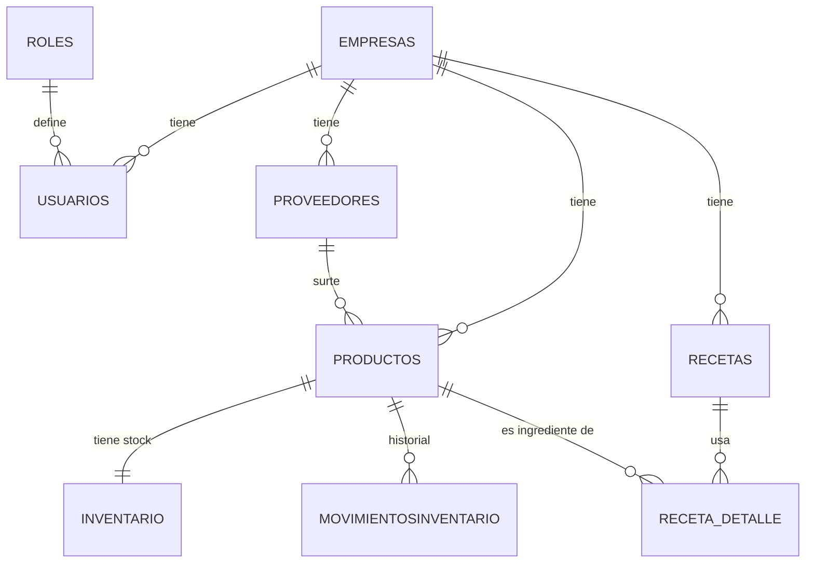

# Inventario App — Backend

Sistema de control de inventario **multiempresa** para insumos y recetas (pensado para negocios de alimentos/bebidas). API REST en Node.js + Express sobre PostgreSQL, organizada por capas (`routes → controller → service → repository`).

> **Estado:** todos los módulos CRUD están implementados y auditados contra el esquema real de la base de datos. Quedan pendientes mejoras de plataforma (autenticación, paginación) documentadas en *Limitaciones conocidas*.

---

## 1. Alcance real (qué existe hoy)

| Módulo / Capacidad | Estado | Nota |
| --- | --- | --- |
| Empresas (CRUD) | ✅ | Entidad raíz del modelo |
| Usuarios (CRUD) | ✅ | Depende de `empresa_id` (URL) y `role_id` existentes |
| Proveedores (CRUD) | ✅ | Campos opcionales (`telefono`/`email`/`domicilio`) realmente opcionales |
| Productos (CRUD) | ✅ | Crea/actualiza junto con su fila de `inventario` en una transacción |
| Inventario | ✅ (solo lectura) | El stock se gestiona desde `/productos` y `/productos/:empresa_id/:id/movimientos` |
| Movimientos de inventario | ✅ | Auditoría completa: compra, venta, merma, ajuste, devolución, producción |
| Recetas (CRUD) | ✅ | `costo_total` se recalcula solo a partir de sus ingredientes |
| Detalle de receta (CRUD) | ✅ | Valida que el ingrediente pertenezca a la misma empresa que la receta |
| Roles | ❌ No expuesto | Solo se cargan por SQL directo en la BD |
| Autenticación / sesión | ❌ No implementado | Todos los endpoints son públicos |
| Reportes y lista de compras | ❌ No implementado | Planeado — se apoyaría en `stock_minimo` + `movimientosinventario` |

Aislamiento multiempresa: **implementado en todos los módulos**. Cada repository filtra por `empresa_id` (directo o vía `JOIN` a `productos`/`recetas`), así que un `id` de otra empresa responde `404` en vez de devolver o modificar datos ajenos.

---

## 2. Stack

- **Runtime:** Node.js 18+
- **Framework:** Express
- **Base de datos:** PostgreSQL 14+ (`pg`, SQL crudo — **no hay ORM ni query builder**)
- **Configuración:** variables de entorno vía `.env`
- **Arquitectura:** módulos de dominio con separación route / controller / service / repository, e inyección de dependencias manual en `routes/index.js`

---

## 3. Instalación

```bash
git clone https://github.com/tuusuario/inventarios_app.git
cd inventarios_app/inventario_BE
npm install
```

Crea el archivo `.env` en la raíz:

```env
DB_USER=postgres
DB_HOST=127.0.0.1
DB_NAME=inventario_db
DB_PASSWORD=tu_password
DB_PORT=5432
PORT=4000
```

Levanta el servidor:

```bash
npm run dev
```

El servidor queda en `http://localhost:4000` y todas las rutas cuelgan de `/api`.

### Variables de entorno

| Variable | Requerida | Default | Descripción |
| --- | --- | --- | --- |
| `DB_USER` | Sí | — | Usuario de PostgreSQL |
| `DB_HOST` | Sí | — | Host de la BD |
| `DB_NAME` | Sí | — | Nombre de la base |
| `DB_PASSWORD` | Sí | — | Contraseña |
| `DB_PORT` | Sí | `5432` | Puerto de PostgreSQL |
| `PORT` | No | `4000` | Puerto del servidor Express |

---

## 4. Estructura del proyecto

```
inventario_BE/
├── src/
│   ├── config/        # Conexión a BD y carga de env
│   ├── modules/        # Dominio: empresas, usuarios, proveedores, productos,
│   │                    #   inventario, movimientos, recetas, recetaDetalle
│   ├── routes/         # Definición de rutas montadas en /api
│   ├── middlewares/    # Middlewares generales
│   ├── utils/          # Funciones reutilizables
│   └── app.js          # Inicialización de Express
├── docs/
│   └── API.md          # Referencia completa de endpoints
├── .env
├── package.json
└── server.js            # Punto de entrada
```

Cada módulo sigue el mismo patrón interno: `*.repository.js` (SQL crudo con `pg`), `*.service.js` (orquesta repositories), `*.controller.js` (parsea `req`/`res` y códigos HTTP).

---

## 5. Modelo de datos



`empresas` es la entidad raíz: todo lo demás cuelga de un `empresa_id`. `productos` e `inventario` son 1 a 1 (un producto siempre tiene exactamente una fila de stock, creada junto con él); `movimientosinventario` es el historial de cambios sobre ese stock.

### Columnas calculadas por PostgreSQL (no se envían en el body)

| Tabla | Columna | Fórmula |
| --- | --- | --- |
| `productos` | `costo_unitario` | `costo_presentacion / cantidad_presentacion` |
| `recetas` | `margen` | `(precio_venta - costo_total) / precio_venta * 100` |
| `receta_detalle` | `costo_final` | `cantidad * costo_unitario` |

`recetas.costo_total` no es una columna generada, pero el backend la recalcula automáticamente (`SUM(costo_final)` de sus `receta_detalle`) cada vez que se agrega, edita o borra un ingrediente.

### Orden obligatorio de carga de datos

1. `POST /api/empresas`
2. Insertar `roles` directamente en la BD (no hay endpoint)
3. `POST /api/usuarios/:empresa_id` con `role_id` existente
4. `POST /api/proveedores/:empresa_id`
5. `POST /api/productos/:empresa_id` con `proveedor_id` existente (crea su inventario automáticamente)
6. `POST /api/recetas/:empresa_id` y luego `POST /api/recetas/:receta_id/detalle` con productos de la misma empresa

Cualquier otro orden rompe por llaves foráneas.

---

## 6. Documentación de API

Referencia completa de endpoints, cuerpos JSON, campos requeridos y ejemplos: **[docs/API.md](docs/API.md)**

---

## 7. Limitaciones conocidas

| ID | Limitación | Por qué importa |
| --- | --- | --- |
| GAP-01 | **Sin autenticación** | Existen `is_admin`, `is_owner`, `role_id` en `usuarios`, pero ningún middleware los verifica. Cualquiera con la URL puede leer o modificar cualquier empresa mientras conozca su `empresa_id`. Es el bloqueante #1 antes de exponer esto fuera de localhost. |
| GAP-02 | Sin paginación ni filtros | Los listados (`GET` de colección) crecen sin límite; con miles de registros el endpoint se vuelve inusable. |
| GAP-03 | `roles` sin endpoint | Obliga a tocar SQL a mano para dar de alta un rol nuevo. |
| GAP-04 | Sin validación de esquema centralizada | Las validaciones son manuales campo por campo en cada repository. Un `zod`/`joi` en middleware reduciría la duplicación. |
| GAP-05 | Sin manejo centralizado de errores ni logging | Cada controller repite su propio `try/catch`; algunos errores SQL crudos se filtran al cliente en el mensaje de `400`. |
| GAP-06 | `PUT /productos` no pasa por movimientos | Sigue siendo posible sobrescribir `stock_actual` directo desde `PUT /api/productos/:empresa_id/:id` sin dejar rastro en `movimientosinventario`. Para trazabilidad, usar siempre `POST /movimientos`. |

---

## 8. Roadmap sugerido (por prioridad)

1. Autenticación por `codigo_ingreso` + JWT y middleware de permisos (GAP-01).
2. Middleware de validación con `zod`/`joi` + manejador de errores centralizado (GAP-04, GAP-05).
3. Endpoint de roles (GAP-03) y paginación en listados (GAP-02).
4. Reportes y lista de compras (`stock_actual < stock_minimo`) por proveedor, apoyado en `movimientosinventario`.
5. Evaluar si `PUT /productos` debe dejar de aceptar `stock_actual`/`stock_minimo` directamente, forzando todo ajuste de stock a pasar por `/movimientos` (GAP-06).

---

## 9. Convenciones

- Header obligatorio en peticiones con body: `Content-Type: application/json`
- Nombres de campos en `snake_case`, en español, consistentes con la BD
- Códigos HTTP: `200` OK · `201` creado · `400` datos inválidos o regla de negocio violada · `404` no encontrado · `500` error interno inesperado
- `empresa_id` siempre viaja en la URL, nunca se toma del body, para que un cliente no pueda reasignar un recurso a otra empresa

---

## 10. Contribuciones y licencia

Abre un issue o pull request para mejoras o correcciones. Proyecto bajo licencia **MIT**.
