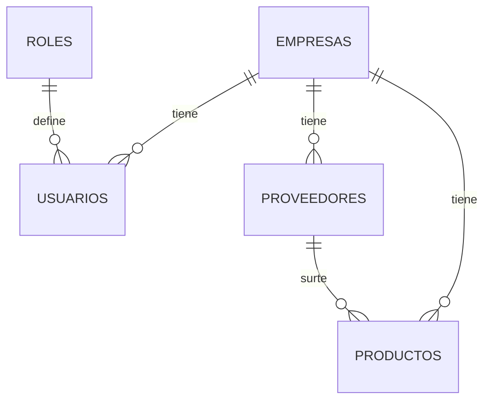

# Inventario App — Backend

Sistema de control de inventario **multiempresa**. API REST en Node.js + Express sobre PostgreSQL, organizada por capas (`routes → controller → repository`).

> **Estado:** en desarrollo activo. Hay 4 módulos CRUD funcionales y varios pendientes críticos documentados en *Estado actual y deuda técnica*.

---

## 1. Alcance real (qué existe hoy)

| Módulo / Capacidad | Estado | Nota |
| --- | --- | --- |
| Usuarios (CRUD) | ✅ Implementado | Depende de `empresa_id` y `role_id` existentes |
| Empresas (CRUD) | ✅ Implementado | Entidad raíz del modelo |
| Productos (CRUD) | ✅ Implementado | Bugs conocidos en validación y DELETE |
| Proveedores (CRUD) | ⚠️ Parcial | INSERT / UPDATE / DELETE con errores de SQL |
| Roles | ❌ No expuesto | Solo se cargan por SQL directo en la BD |
| Autenticación / sesión | ❌ No implementado | Todos los endpoints son públicos |
| Aislamiento por empresa | ❌ No implementado | Los `GET` devuelven datos de todas las empresas |
| Movimientos / trazabilidad de stock | ❌ No implementado | Hoy `stock_actual` se sobrescribe, no se audita |
| Reportes y lista de compras | ❌ No implementado | Planeado |

---

## 2. Stack

- **Runtime:** Node.js 18+
- **Framework:** Express
- **Base de datos:** PostgreSQL 14+ (`pg`, SQL crudo — **no hay ORM ni query builder**)
- **Configuración:** variables de entorno vía `.env`
- **Arquitectura:** módulos de dominio con separación route / controller / repository

---

## 3. Instalación

```bash
git clone https://github.com/tuusuario/inventarios_app.git
cd inventarios_app/inventario_BE
npm install
```

Crea el archivo `.env` en la raíz:

```env
DB_USER=postgres
DB_HOST=127.0.0.1
DB_NAME=inventario_db
DB_PASSWORD=tu_password
DB_PORT=5432
PORT=4000
```

Levanta el servidor:

```bash
npm run dev
```

El servidor queda en `http://localhost:4000` y todas las rutas cuelgan de `/api`.

### Variables de entorno

| Variable | Requerida | Default | Descripción |
| --- | --- | --- | --- |
| `DB_USER` | Sí | — | Usuario de PostgreSQL |
| `DB_HOST` | Sí | — | Host de la BD |
| `DB_NAME` | Sí | — | Nombre de la base |
| `DB_PASSWORD` | Sí | — | Contraseña |
| `DB_PORT` | Sí | `5432` | Puerto de PostgreSQL |
| `PORT` | No | `4000` | Puerto del servidor Express |

---

## 4. Estructura del proyecto

```
inventario_BE/
├── src/
│   ├── config/        # Conexión a BD y carga de env
│   ├── modules/       # Dominio: usuarios, empresas, productos, proveedores
│   ├── routes/        # Definición de rutas montadas en /api
│   ├── middlewares/   # Middlewares generales
│   ├── utils/         # Funciones reutilizables
│   └── app.js         # Inicialización de Express
├── docs/
│   └── API.md         # Referencia completa de endpoints
├── .env
├── package.json
└── server.js          # Punto de entrada
```

---

## 5. Modelo de datos



`empresas` es la entidad raíz: todo lo demás cuelga de un `empresa_id`. Eso convierte al sistema en **multi-tenant por columna**, lo cual funciona, pero exige que cada query filtre por empresa. Hoy no lo hace (ver GAP-02).

### Orden obligatorio de carga de datos

1. `POST /api/empresas`
2. Insertar `roles` directamente en la BD (no hay endpoint)
3. `POST /api/usuarios` con `empresa_id` y `role_id` existentes
4. `POST /api/proveedores` con `empresa_id` existente
5. `POST /api/productos` con `empresa_id` y `proveedor_id` existentes

Cualquier otro orden rompe por llaves foráneas.

---

## 6. Documentación de API

Referencia completa de endpoints, cuerpos JSON, campos requeridos y ejemplos: **[docs/API.md](docs/API.md)**

---

## 7. Estado actual y deuda técnica

### Bugs confirmados en código

| ID | Módulo | Problema | Impacto | Fix |
| --- | --- | --- | --- | --- |
| BUG-01 | Productos | El `catch` del repository usa `throw new error(...)` | `TypeError` que oculta el error real en DELETE | Cambiar a `throw new Error(...)` |
| BUG-02 | Productos | Validaciones con `!campo` | Rechaza valores válidos como `0` en `stock_actual`, `stock_minimo`, costos | Validar con `campo === undefined \|\| campo === null` |
| BUG-03 | Proveedores | `INSERT` declara 4 columnas pero envía 5 valores (incluye `contacto`) | Falla toda creación de proveedor | Agregar `contacto` al SQL o quitarlo del payload |
| BUG-04 | Proveedores | `UPDATE` declara 4 campos + `id` pero envía 6 valores | Falla toda actualización | Alinear columnas y parámetros |
| BUG-05 | Proveedores | `DELETE` usa `?` como placeholder | `pg` requiere `$1`; la query truena | Cambiar a `$1` |

### Huecos de diseño (más importantes que los bugs)

| ID | Hueco | Por qué importa |
| --- | --- | --- |
| GAP-01 | **Sin autenticación** | Existen `is_admin`, `is_owner`, `role_id`, pero ningún middleware los verifica. Cualquiera con la URL puede borrar productos. Es el bloqueante #1 antes de exponer esto fuera de localhost. |
| GAP-02 | **Sin aislamiento por empresa** | `GET /api/productos` devuelve el inventario de *todas* las empresas. En un sistema multi-tenant esto es fuga de datos entre clientes, no un detalle cosmético. |
| GAP-03 | Sin paginación ni filtros | Los listados crecen sin límite; con 5,000 SKUs el endpoint se vuelve inusable. |
| GAP-04 | `costo_unitario` denormalizado | Es derivable de `costo_presentacion / cantidad_presentacion`. Guardarlo aparte garantiza que tarde o temprano se desincronice. O se calcula al vuelo, o el backend lo recalcula siempre e ignora el valor del cliente. |
| GAP-05 | Respuestas de `DELETE` inconsistentes | Productos no regresa `id`; los demás sí. Rompe el contrato para el frontend. |
| GAP-06 | `roles` sin endpoint | Obliga a tocar SQL a mano para dar de alta un usuario. |
| GAP-07 | Sin validación de esquema | Validaciones manuales campo por campo. Un `zod`/`joi` en middleware elimina BUG-02 y toda su familia. |
| GAP-08 | Sin manejo centralizado de errores ni logging | Los errores SQL se filtran crudos al cliente (500 con detalle de la query). |

### Riesgo funcional

El sistema se llama "control de inventario" pero **no registra movimientos**. Hoy `stock_actual` se sobrescribe con un `PUT`, así que no hay forma de responder *quién* movió stock, *cuándo* ni *por qué*. Sin una tabla `movimientos_inventario` (entrada / salida / merma / ajuste), no hay trazabilidad, no hay reportes reales y la "lista de compras" solo puede compararse contra `stock_minimo` sin contexto.

---

## 8. Roadmap sugerido (por prioridad)

1. Corregir BUG-01 a BUG-05 (bloquean uso básico).
2. Middleware de validación con `zod` + manejador de errores centralizado (GAP-07, GAP-08).
3. Autenticación por `codigo_ingreso` + JWT y middleware de permisos (GAP-01).
4. Forzar filtro por `empresa_id` en todos los repositories (GAP-02).
5. Tabla `movimientos_inventario` y endpoints de entrada/salida.
6. Endpoint de roles (GAP-06) y paginación en listados (GAP-03).
7. Reportes y lista de compras por proveedor.

---

## 9. Convenciones

- Header obligatorio en peticiones con body: `Content-Type: application/json`
- Nombres de campos en `snake_case`, en español, consistentes con la BD
- Códigos HTTP: `200` OK · `201` creado · `400` datos inválidos · `404` no encontrado · `500` error interno

---

## 10. Contribuciones y licencia

Abre un issue o pull request para mejoras o correcciones. Proyecto bajo licencia **MIT**.
